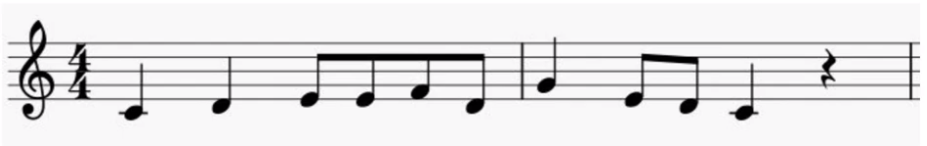
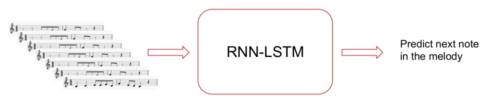
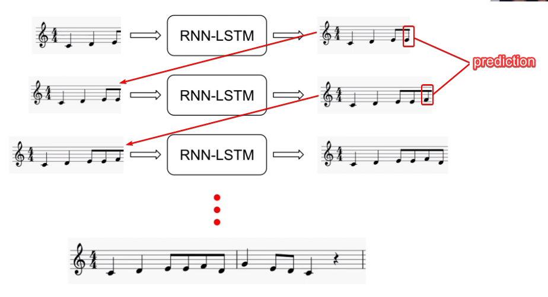

## Table of Contents

1. [What is Melody?](#what-is-melody)
2. [Melody generation problem](#melody-generation-problem)
3. [How to train a Neural Network](#how-to-train-a-neural-network)
4. [Why do we use an RNN-LSTM?](#why-do-we-use-an-rnn-lstm)
5. [The melody dataset](#the-melody-dataset)

&nbsp;

## What is Melody?

- A melody is a musical sequence made up of a combination of notes and rests
- Aspect of a piece of music
- Melodies are characterized by their pitch, rhythm etc

 

- According to the above image,
  - Y axis for pitch (frequency)
  - X axis for time

&nbsp;

## Melody generation problem

- Melody generation is a computational music composition problem due to melodies are treated as time series data
- Melody generation problem = Time-series prediction problem
- AI uses "vocabulary" of musical notes and durations to make structured and harmonious melodies
- The "vocabulary of notes" refers to the set of musical elements available for generating the melody, including specific pitches, durations, and other musical attributes.

 

- Goal => generate a sequence of musical notes and rests, one after the other, based on a given context or set of rules

&nbsp;

## How to train a Neural Network

1. Passing chunks of melodies to LSTM
2. Ask the LSTM for predictions
3. Predict the next part of the melody

 

   

## Why do we use an RNN-LSTM?

RNN-LSTM means, Recurrent Neural Networks with Long Short-Term Memory cells

- We use RNN-LSTM melody generation because melodies often have long-term structural patterns
- LSTMs are well-suited for capturing long-term temporal dependencies in the music because they can utilize information from earlier parts of the melody when generating subsequent notes
- LSTM helps melodies sound better with a clear structure.

&nbsp;

## The melody dataset

- Traditional folk melodies (because they are simple)
- ESAC dataset 5K+ songs from all over the world

Dataset link => [http://www.esac-data.org/](http://www.esac-data.org/)
