## Table of contents

&nbsp;

## Note

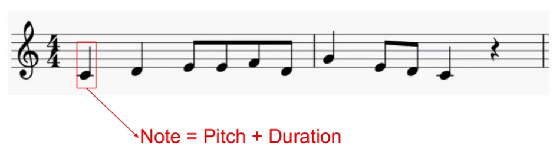

- Note will give the information about Pitch & Duration

&nbsp;

## Pitch

- Indicates how high or low a note is
- Higher frequency = Higher pitch

 

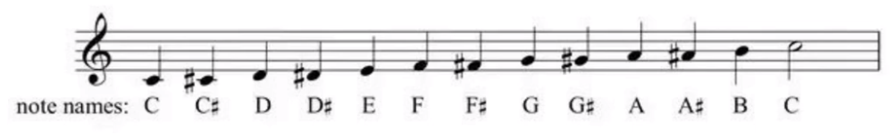

- frequency of the second ( last ) C note = 2 \* first C note
- So, note name is not enough for identify a note. That's why scientific pitch notation comes in

&nbsp;

## Scientific Pitch Notation

- Note name + octave
- E.g., C3, D4, A1
- C3 means, C note in the 3rd octave

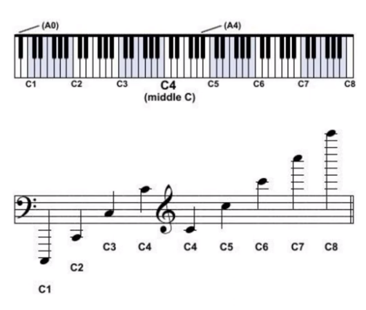

- The quality is same for all these C notes
- In music retrieval, "chroma" usually refers to the "chroma feature"
- Chroma represents the twelve different pitch classes (like C, C#, D, etc.) in music
- Western music has 12 different pitches
- It's used for tasks such as chord recognition or analyzing music similarity
- Chroma is related to the harmonic content of music but doesn't describe the overall sound quality, which is what makes different instruments and voices sound unique

&nbsp;

## MIDI note notation

- MIDI => Musical Instrument Digital Interface
- This is another way to identify a pitch
- MIDI is a protocol that allows electronic musical instruments, computers, and other devices to communicate with each other in order to play, edit, and record music
- MIDI mainly shares music details like notes, pitch, time, and volume, allowing different instruments and software to work together in creating and performing music smoothly
- In MIDI, note names maps to numbers
  - e.g., C4 = 60

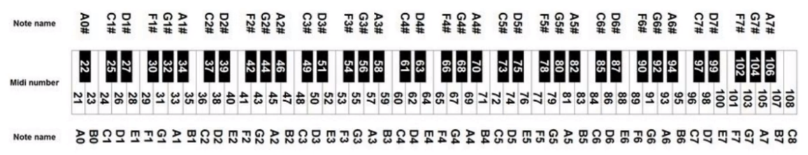

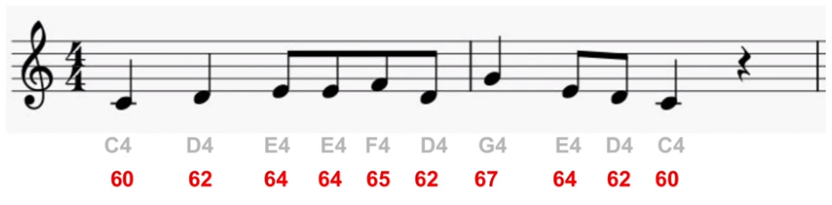

&nbsp;

## Note values

- Following symbols express about the duration of the notes

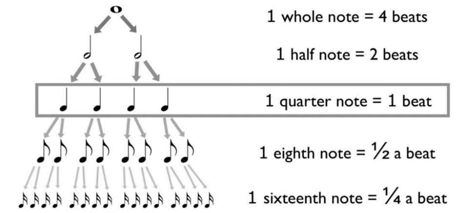

&nbsp;

## Melody

- Melodies divided into bars
- In music, a bar (measure) is a fundamental unit of time within a melody
- It represents a specific number of beats, typically organized by a time signature like 4/4 or 3/4
- Melodies are divided into these bars, making it easier for musicians to read and perform the music with a consistent rhythm and timing

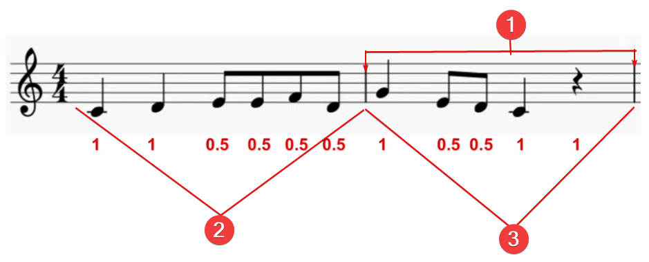

1. End of the bar
2. Bar number 1
3. Bar number 2

 

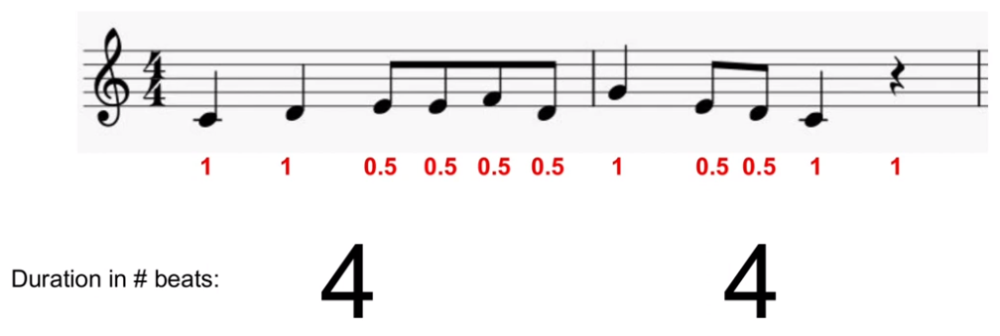

&nbsp;

## Time Signature

- Denominator tells us, type of note which equals to 1 beat
  - If denominator = 4. Its mean, a quater note = 1 beat
- Numerator tells us, number of beats in a bar
  - according to the above image, we have 4 beats in a each bar

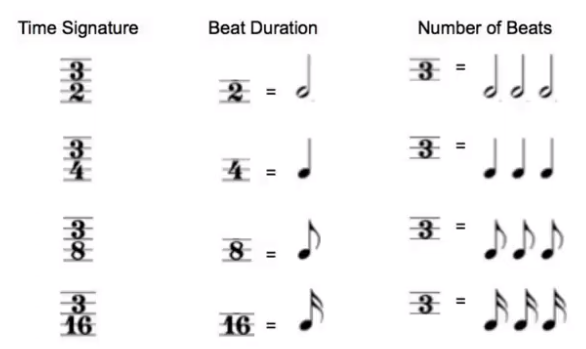

- Beat Duration: according to 1st time signature, duration for each beat is half note (beat is identify with a quater note)

=> Shape of the melody depends on this time signature. That's why this time signature is important

&nbsp;

## Key

- Key is a group of pitches that sets the central tone for a piece
- It is determined by the tonic note and the musical mode used
- E.g., C maj, D min
- The key influences the overall mood and harmony of the music

### Tonic / Tonic note

- The "tonic" in music is the foundational pitch that gives a sense of arrival and stability
- It serves as the center of gravity for the musical piece
- Often found at the beginning/end of a piece

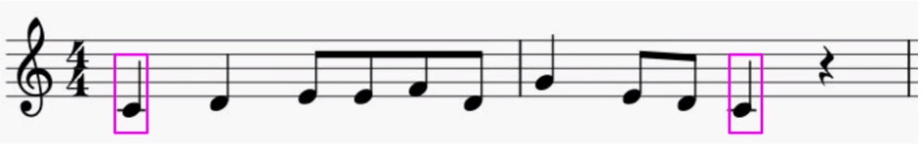

### Number of keys

- 12 notes \* 2 modes = 24 keys (2 modes = major & minor)

&nbsp;

## Major / minor scale

- Happiness, Joy with Major
- Sadness with mino

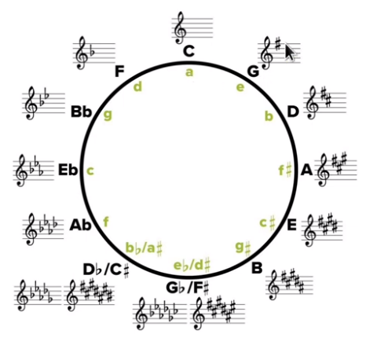

&nbsp;

## Transposition

- Process of shifting a collection of notes up or down by a specified interval
- What is happen in the transposition?
  - changing the key while keeping the musical content and relationships between notes the same
- Musical content remains the same

&nbsp;

## Music Representation

We can't use western music notations as a inputs for Neural networks

### Idea 01:

- Convert melodies to sequence representation
- Pitch / duration info for each note  
  E.g., [(C4, 1), (D4, 1), ....] <== list of tuples

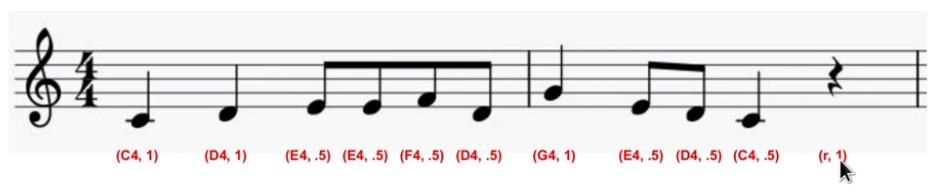

- (r, 1) for rest => r for rest & 1 for beat

 

### Idea 02:

- involves capturing a piece of music as a time series
- sample melod at each 16th note
- each step corresponds to a 16th note
- log MIDI notes when they occur, using "\_" for sustained notes and "r" to represent rests when there's no sound
- this method allows for a detailed and structured representation of music

&nbsp;

## Example for Time series representation

- 4/4 time signature, its means each bar have 16 samples. Because we have 16 16th notes in a 4/4 bar
- 4 samples per quater note

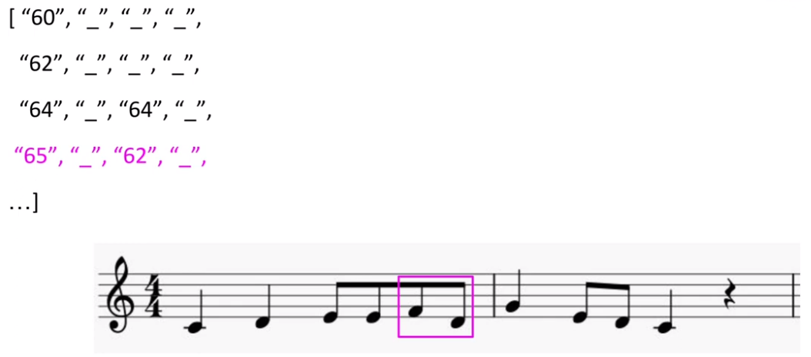

&nbsp;

## Preparing melodies for LSTM ingestion

Time series representation is not enough for LSTM. So we should follow the following steps for preparing melodies

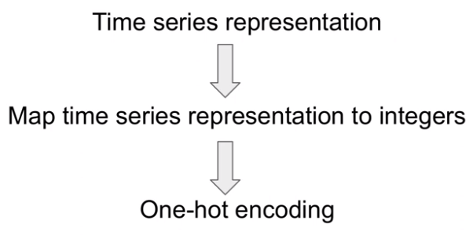
